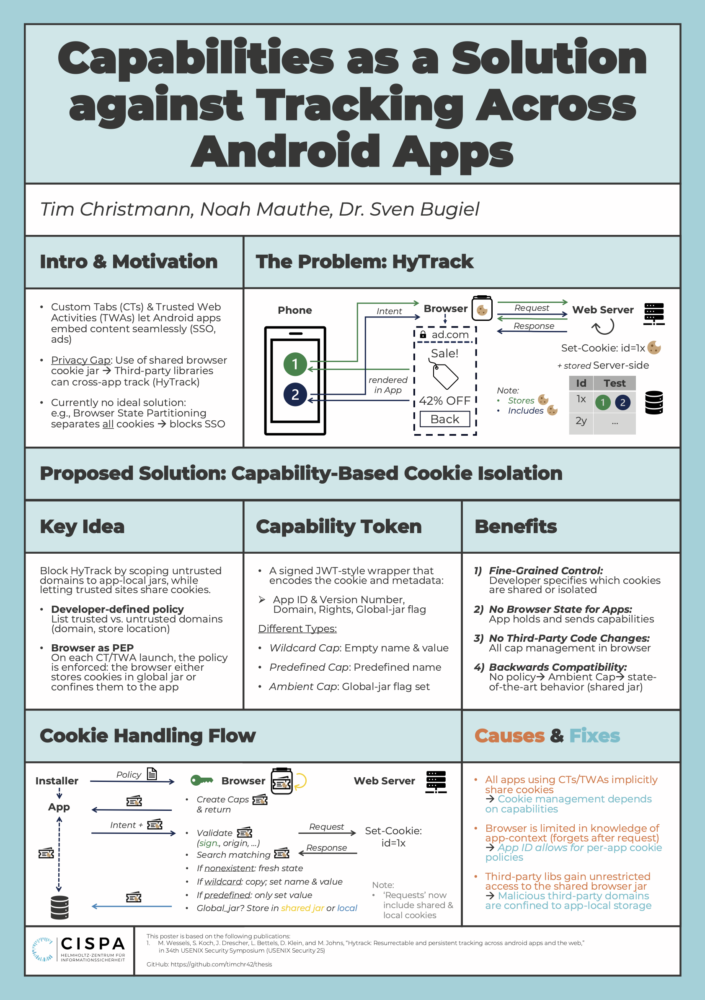

# README

This is the artifact of the bachelor thesis "Capabilities as a Solution against Tracking Across Android Apps" featuring a defense mechanism against HyTrack, a new mobile tracking technique.

## Structure

- `demo`: Contains a demo vieo of the defense mitigation in action, as well as a description of the demo.
- `PoC`: Contains the proof-of-concept implementation of the HyTrack webapp, their two android apps equipped with the defense mechanism (with and without policy), a well meaning test app, a malicious "Evil" app and a custom installer. 
The [library](https://github.com/timchr42/byetrack) which implements the defense mechanism can be found extern on github, such as the modified androidx.browser [library](https://github.com/timchr42/AndroidxBrowserByetrack), demonstating how it can be hooked into the existing android ecosystem and the modified [firefox](https://github.com/timchr42/firefox) browser for andoid.

## Concept Overview

## Usage
Refer to the READMEs in the respective subfolders.
